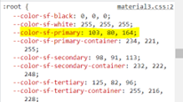
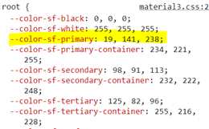

# Material3 Theme

Material 3 includes updated theming, components and Material You personalization features like dynamic color, and is designed to be cohesive with the new visual style and system UI on Android 12 and above. For more information, please find this [documentation](https://m3.material.io/).

## Syncfusion Material3 Theme

We have added the material 3 theme light and dark variants to all Syncfusion EJ2 Controls. In this theme, we have provided the Css variables with rgba() values for color variants. So, you can easily customize the theme colors by overriding the Css variables.

## Css Variables

CSS variables, also known as custom properties, are a powerful feature in CSS that enables you to define reusable values and utilize them throughout your stylesheets. They are prefixed with "--" and can be used in any property value within a CSS rule. To insert the value of a CSS variable, you can use the var() function. CSS variables can access the Document Object Model (DOM), allowing you to create variables with either local or global scope. You can modify these variables using JavaScript and even change them based on media queries.

### Syncfusion Provided Css variables support

We have integrated CSS variable support for our Material 3 theme. In this theme, we have incorporated CSS variables with rgb() values for our color variables.

```css
:root {
  --color-sf-black: 0, 0, 0;
  --color-sf-white: 255, 255, 255;
  --color-sf-primary: 103, 80, 164;
  --color-sf-primary-container: 234, 221, 255;
  --color-sf-secondary: 98, 91, 113;
  --color-sf-secondary-container: 232, 222, 248;
  --color-sf-tertiary: 125, 82, 96;
  --color-sf-tertiary-container: 255, 216, 228;
  --color-sf-surface: 255, 255, 255;
  --color-sf-surface-variant: 231, 224, 236;
  --color-sf-background: var(--color-sf-surface);
  --color-sf-on-primary: 255, 255, 255;
  --color-sf-on-primary-container: 33, 0, 94;
  --color-sf-on-secondary: 255, 255, 255;
  --color-sf-on-secondary-container: 30, 25, 43;
  --color-sf-on-tertiary: 255, 255, 255;
}
```

### Customizing the Colors

Using these CSS variables, you can easily customize the color variables. For example, to customize the primary color variable in this theme, you can simply change its value in the root values.

**Default primary value**



**Customized primary value**



With this CSS variable support, you can effortlessly customize the color variable values for our EJ2 controls.

## Dark mode support

We have unified the light theme and dark theme values into a single definition file. This allows for easy switching between light and dark modes for our controls.

```css
.e-dark-mode {
  --color-sf-black: 0, 0, 0;
  --color-sf-white: 255, 255, 255;
  --color-sf-primary: 208, 188, 255;
  --color-sf-primary-container: 79, 55, 139;
  --color-sf-secondary: 204, 194, 220;
  --color-sf-secondary-container: 74, 68, 88;
  --color-sf-tertiary: 239, 184, 200;
  --color-sf-tertiary-container: 99, 59, 72;
  --color-sf-surface: 28, 27, 31;
  --color-sf-surface-variant: 28, 27, 31;
  --color-sf-background: var(--color-sf-surface);
  --color-sf-on-primary: 55, 30, 115;
  --color-sf-on-primary-container: 234, 221, 255;
  --color-sf-on-secondary: 51, 45, 65;
  --color-sf-on-secondary-container: 232, 222, 248;
  --color-sf-on-tertiary: 73, 37, 50;
}
```

### How to switch to dark mode

With this CSS variable support, switching between light and dark theme modes is a breeze. To switch to dark mode, simply add the 'e-dark-mode' class to the body section of your application. Once you've added this class, the theme will switch to dark mode. Please refer to the image below for an example.


## ThemeStudio application

We have also integrated the Material 3 theme into our ThemeStudio application. So, you can utilize this application for your customization needs as well.

https://ej2.syncfusion.com/themestudio/?theme=material3
