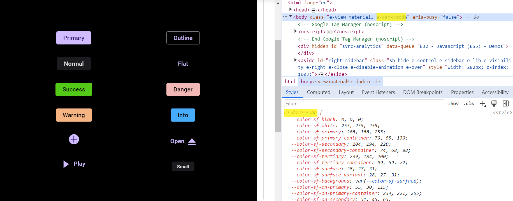

# Material3 Theme

Material 3 is an updated theme that encompasses enhanced theming, components, and personalization features, including dynamic color capabilities. It has been specifically designed to align seamlessly with the new visual style and system UI introduced in Android 12 and above. For more detailed information, please refer to the following link: [ Link to Material 3 Information](https://m3.material.io/).

## Syncfusion Material3 Theme

We are pleased to announce that we have incorporated the Material 3 theme, featuring light and dark variants, into all Syncfusion EJ2 Controls. This theme implementation leverages CSS variables, allowing effortless customization of Syncfusion control colors directly within the CSS format. This approach facilitates the smooth transition between light and dark color schemes, providing users with a highly adaptable solution that caters to their preferences and application requirements.

> Note: Please be aware that in the Material3 theme, we utilize CSS variables with rgb() values for our color variables. Using hex values in this context may lead to improper functionality.

| Color Variants | Correct | Incorrect |
|----|----|----|
|Primary | 103, 80, 164 | #6750a4 |
|Secondary | 98, 91, 113 | #625b71 |
|Surface | 255, 255, 255 | #ffffff |
|Success | 0, 172, 126 | #00ac7e |

## What are Css Variables?

CSS variables, also known as custom properties, are a powerful feature in CSS that allows you to define reusable values and apply them throughout your stylesheets. Prefixed with "--," CSS variables can be utilized in any property value within a CSS rule. To retrieve the value of a CSS variable, the var() function is used. CSS variables can access the Document Object Model (DOM), enabling the creation of variables with either local or global scope. For further details, please consult the following link: [Link to CSS Variables Information](https://developer.mozilla.org/en-US/docs/Web/CSS/Using_CSS_custom_properties).

### How does Syncfusion Theming utilize CSS Variables?

The Material 3 theme in our system incorporates CSS variable support, utilizing CSS variables with rgb() values for color customization.

```css
:root {
  --color-sf-black: 0, 0, 0;
  --color-sf-white: 255, 255, 255;
  --color-sf-primary: 103, 80, 164;
  --color-sf-primary-container: 234, 221, 255;
  --color-sf-secondary: 98, 91, 113;
  --color-sf-secondary-container: 232, 222, 248;
  --color-sf-tertiary: 125, 82, 96;
  --color-sf-tertiary-container: 255, 216, 228;
  --color-sf-surface: 255, 255, 255;
  --color-sf-surface-variant: 231, 224, 236;
  --color-sf-background: var(--color-sf-surface);
  --color-sf-on-primary: 255, 255, 255;
  --color-sf-on-primary-container: 33, 0, 94;
  --color-sf-on-secondary: 255, 255, 255;
  --color-sf-on-secondary-container: 30, 25, 43;
  --color-sf-on-tertiary: 255, 255, 255;
}
```

### Exploring Color Customization

Through the utilization of these CSS variables, customization of the color variables becomes remarkably straightforward. For example, to customize the primary color variable in this theme, simply modify its value in the root values.

**Default primary value**


**Customized primary value**


With this CSS variable support, you can effortlessly customize the color variable values for our EJ2 controls.

## Dark mode support

The controls in our system now seamlessly transition between light and dark modes without any noticeable delay, achieved by consolidating the light theme and dark theme configurations into a single definition file.


```css
.e-dark-mode {
  --color-sf-black: 0, 0, 0;
  --color-sf-white: 255, 255, 255;
  --color-sf-primary: 208, 188, 255;
  --color-sf-primary-container: 79, 55, 139;
  --color-sf-secondary: 204, 194, 220;
  --color-sf-secondary-container: 74, 68, 88;
  --color-sf-tertiary: 239, 184, 200;
  --color-sf-tertiary-container: 99, 59, 72;
  --color-sf-surface: 28, 27, 31;
  --color-sf-surface-variant: 28, 27, 31;
  --color-sf-background: var(--color-sf-surface);
  --color-sf-on-primary: 55, 30, 115;
  --color-sf-on-primary-container: 234, 221, 255;
  --color-sf-on-secondary: 51, 45, 65;
  --color-sf-on-secondary-container: 232, 222, 248;
  --color-sf-on-tertiary: 73, 37, 50;
}
```

### How to switch to dark mode

Thanks to the CSS variable support, transitioning between light and dark theme modes has become effortless. To switch to dark mode, simply add the 'e-dark-mode' class to the body section of your application. Upon adding this class, the theme will seamlessly switch to dark mode. Please refer to the example image below for guidance.



## ThemeStudio application

We have also integrated the Material 3 theme into our ThemeStudio application, providing you with a comprehensive solution for your customization needs.

Access the Syncfusion ThemeStudio application, featuring the Material 3 theme, via the following link: [Link to Syncfusion ThemeStudio with Material 3 Theme](https://ej2.syncfusion.com/themestudio/?theme=material3)
