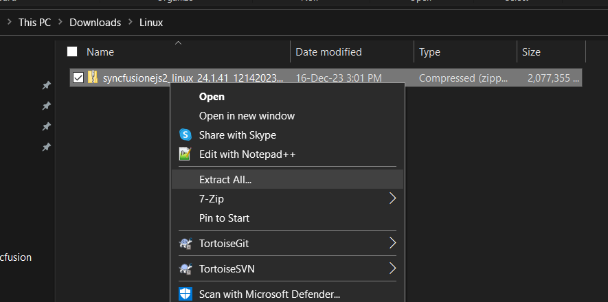
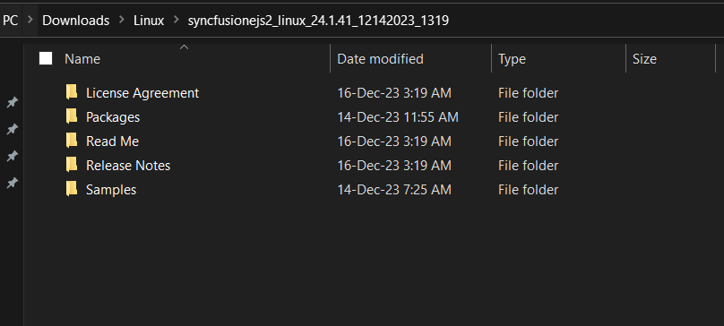

# Installing Syncfusion JavaScript Linux installer

## Overview

Syncfusion provides the Linux installer for the following Essential Studio products.

* Blazor
* Flutter
* ASP.NET Core
* JavaScript
* File Formats
* PDF
* Word
* Excel
* PowerPoint

## Step-by-Step Installation

The steps below show how to install JavaScript Linux installer.

1. Extract the Syncfusion JavaScript Linux installer(.zip) file. The files are extracted in your machine.

   
   

2. The Linux zip file contains the following folders.

      
   
   N> The Unlock key is not required to install the Linux installer.

4. You can launch the demo source and use the NuGet packages included in the Linux installer.

5. Run the following command in linux machine to deploy the ASP.NET Core samples
 
  **dotnet restore projectname -s \nuget** in order to restore.

## License key registration in samples

After the installation, the license key is required to register the demo source that is included in the Linux installer. To learn about the steps for license registration for the JavaScript - EJ2 Linux installer, please refer to this.

Register the license key by using [registerLicense](https://ej2.syncfusion.com/javascript/documentation/licensing/license-key-registration#javascript-es5) method after the Syncfusion JavaScript script file reference.