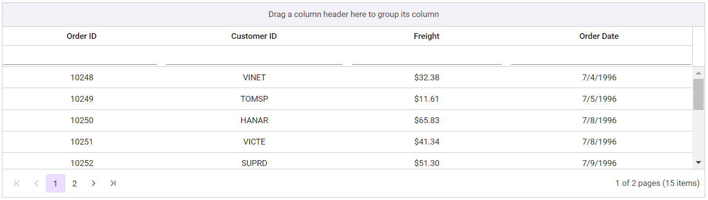

# Getting Started with Syncfusion JavaScript (Essential JS 2) Library and Astro Framework

This article provides a step-by-step guide for setting up an [AstroJS](https://astro.build/) project and integrating the Syncfusion JavaScript (Essential JS 2) library.

## Prerequisites

* [Node.js >= v18.14.x](https://nodejs.org/en/)
* [Visual Studio Code](https://code.visualstudio.com/)

## Set up the AstroJS project

A recommended approach for beginning with Vue is to scaffold a project using [AstroJS](https://astro.build/). To create a new Astro project, use one of the commands that are specific to either NPM or Yarn.

```bash
npm create astro@latest
```

or

```bash
yarn create astro
```

Using one of the above commands will lead you to set up additional configurations for the project, as below:

1\. Define the directory name: We can specify the name of the project directly. Let's specify the name of the project as `my-project` for this article.

```bash
[dir]   Where should we create your new project?
        ./my-project
```

2\. Choose a template to initiate a new project. Currently, select the recommended template.

```bash
[tmpl]   How would you like to start your new project?
        > Include sample files (recommended)
        — Use blog template
        — Empty
```

3\. Install dependencies based on project requirements. In this article, opt for `Yes` to install the necessary dependencies.

```bash
[deps]   Install dependencies? (recommended)
        ● Yes  ○ No
```

4\. Select `Yes` to designate Typescript as the framework variant.

```bash
[ts]   Do you plan to write TypeScript?
        ● Yes  ○ No
```

5\. Choose the recommended option to enforce strict typing in the project.

```bash
[use]   How strict should TypeScript be?
        > Strict (recommended)
        — Strictest
        — Relaxed
```

6\. If necessary, initialize a new git repository by selecting `Yes`.

```bash
[git]   Initialize a new git repository? (optional)
        ● Yes  ○ No
```

7\. Upon completing the aforementioned steps to create the `my-project`, run the following command to navigate to the project directory:

```bash
cd my-project
```

Now that `my-project` is ready to run with default settings, let's add Syncfusion controls to the project.

## Add Syncfusion Javascript packages

Syncfusion JavaScript control packages are available at [npmjs.com](https://www.npmjs.com/search?q=ej2-vue). To use Syncfusion Javascript controls in the project, install the corresponding npm package.

This article uses the [Javascript Grid control](https://www.syncfusion.com/javascript-ui-controls/js-data-grid) as an example. To use the JavaScript Grid control in the project, the `@syncfusion/ej2-grids` package needs to be installed using the following command:

```bash
npm install @syncfusion/ej2-grids --save
```

or

```bash
yarn add @syncfusion/ej2-grids
```

## Import Syncfusion CSS styles

You can import themes for the Syncfusion Vue component in various ways, such as using CSS or SASS styles from npm packages, CDN, CRG and [Theme Studio](https://ej2.syncfusion.com/vue/documentation/appearance/theme-studio/). Refer to the [themes topic](https://ej2.syncfusion.com/vue/documentation/appearance/theme/) to learn more about built-in themes and different ways to refer to themes in a project.

In this article, the `Material 3` theme is applied using CSS styles, which are available in installed packages. The necessary `Material 3` CSS styles for the Grid component and its dependents were imported into the `<link>` tag of the **src/pages/index.astro** file.




<Layout title="Astro samples">
    <link rel="stylesheet" href="../../node_modules/@syncfusion/ej2-base/styles/material3.css" />
    <link rel="stylesheet" href="../../node_modules/@syncfusion/ej2-buttons/styles/material3.css">
    <link rel="stylesheet" href="../../node_modules/@syncfusion/ej2-calendars/styles/material3.css">
    <link rel="stylesheet" href="../../node_modules/@syncfusion/ej2-dropdowns/styles/material3.css">
    <link rel="stylesheet" href="../../node_modules/@syncfusion/ej2-inputs/styles/material3.css">
    <link rel="stylesheet" href="../../node_modules/@syncfusion/ej2-navigations/styles/material3.css">
    <link rel="stylesheet" href="../../node_modules/@syncfusion/ej2-popups/styles/material3.css">
    <link rel="stylesheet" href="../../node_modules/@syncfusion/ej2-splitbuttons/styles/material3.css">
    <link rel="stylesheet" href="../../node_modules/@syncfusion/ej2-vue-grids/styles/material3.css">
</Layout>




> The order of importing CSS styles should be in line with its dependency graph.

## Add Syncfusion JavaScript control

Follow the below steps to add the JavaScript Grid control:

1\. First, create the **~/src/components/Grids.ts**. Then, import and define the Grid component with the [dataSource](https://ej2.syncfusion.com/documentation/api/grid#datasource) property and column definitions.




import { Grid, Group, Filter, Page, Sort } from '@syncfusion/ej2-grids';
import { GridData } from './dataSource';

Grid.Inject(Group, Filter, Page, Sort);

let grid: Grid = new Grid({
    dataSource: GridData,
    columns: [
        { field: 'OrderID', headerText: 'Order ID', textAlign: 'Center', width: 120, type: 'number' },
        { field: 'CustomerID', width: 140, headerText: 'Customer ID', textAlign: 'Center', type: 'string' },
        { field: 'Freight', headerText: 'Freight', textAlign: 'Center', width: 120, format: 'C' },
        { field: 'OrderDate', headerText: 'Order Date', textAlign: 'Center', width: 140, format: 'yMd' }
    ],
    height: 175,
    allowGrouping: true,
    allowPaging: true,
    allowSorting: true,
    allowFiltering: true
});

grid.appendTo('#Grid');




2\. Create a `<div>` element with `id="Grid"` where the control get mounted and link the script file in **~/src/pages/index.astro**.




<Layout title="Astro samples">
	<div id="Grid"></div>
	<script src="../components/Grid"></script>
</Layout>




Here is the summarized code for the above steps:




import { Grid, Group, Filter, Page, Sort } from '@syncfusion/ej2-grids';
import { GridData } from './dataSource';

Grid.Inject(Group, Filter, Page, Sort);

let grid: Grid = new Grid({
    dataSource: GridData,
    columns: [
        { field: 'OrderID', headerText: 'Order ID', textAlign: 'Center', width: 120, type: 'number' },
        { field: 'CustomerID', width: 140, headerText: 'Customer ID', textAlign: 'Center', type: 'string' },
        { field: 'Freight', headerText: 'Freight', textAlign: 'Center', width: 120, format: 'C' },
        { field: 'OrderDate', headerText: 'Order Date', textAlign: 'Center', width: 140, format: 'yMd' }
    ],
    height: 175,
    allowGrouping: true,
    allowPaging: true,
    allowSorting: true,
    allowFiltering: true
});

grid.appendTo('#Grid');




<div>
	<div id="Grid"></div>
	<script src="../components/Grid"></script>
	<link rel="stylesheet" href="../../node_modules/@syncfusion/ej2-base/styles/material3.css">
	<link rel="stylesheet" href="../../node_modules/@syncfusion/ej2-buttons/styles/material3.css">
	<link rel="stylesheet" href="../../node_modules/@syncfusion/ej2-popups/styles/material3.css">
	<link rel="stylesheet" href="../../node_modules/@syncfusion/ej2-navigations/styles/material3.css">
	<link rel="stylesheet" href="../../node_modules/@syncfusion/ej2-dropdowns/styles/material3.css">
	<link rel="stylesheet" href="../../node_modules/@syncfusion/ej2-lists/styles/material3.css">
	<link rel="stylesheet" href="../../node_modules/@syncfusion/ej2-inputs/styles/material3.css">
	<link rel="stylesheet" href="../../node_modules/@syncfusion/ej2-grids/styles/material3.css">
</div>




## Run the project

To run the project, use the following command:

```bash
npm run dev
```

or

```bash
yarn run dev
```

The output will appear as follows:


