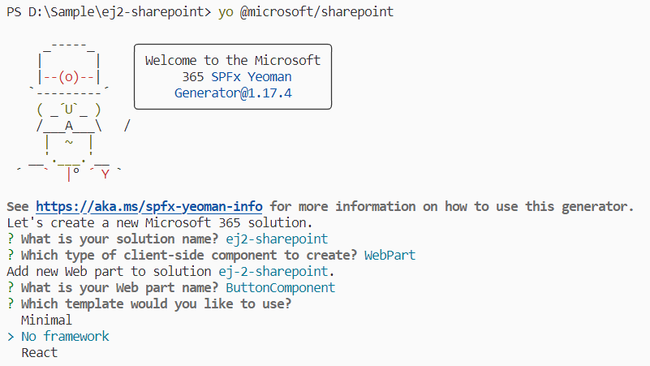
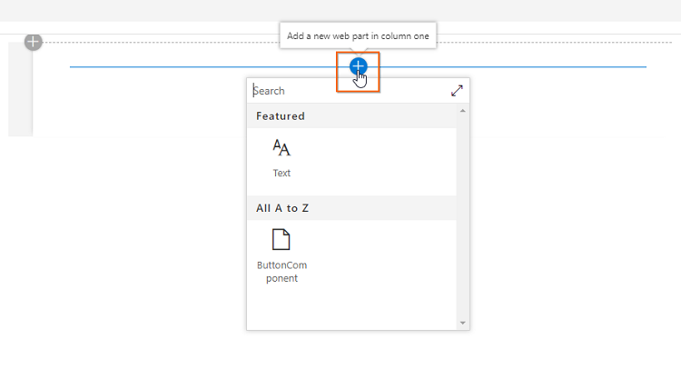
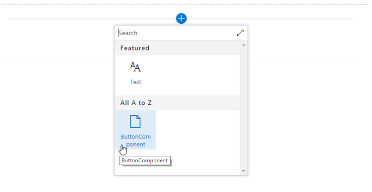

# Getting Started with Syncfusion JavaScript (Essential JS 2) library and SharePoint Framework (SPFx)

This article provides a step-by-step introduction to configure Syncfusion JavaScript (Essential JS 2) library and build a simple SharePoint framework application in Visual Studio Code.

## What is SharePoint?

[SharePoint](https://learn.microsoft.com/en-us/sharepoint/dev/spfx/sharepoint-framework-overview) Framework is a development model used to create custom web parts and extensions for SharePoint Online and SharePoint on-premises. It is based on modern web technologies such as TypeScript, React, and Node.js.

## Prerequisites

* [Node.js](https://nodejs.org/en/)
* [Visual Studio Code](https://code.visualstudio.com/)

## Setup development environment

1.Create a new directory `ej2-sharepoint`, open the command prompt from that directory, and install the required SharePoint client-side development tools with global flag.

on Windows:




npm install -g yo gulp @microsoft/generator-sharepoint




on OSX / LINUX:




sudo npm install -g yo gulp @microsoft/generator-sharepoint




    > The Yeoman SharePoint web part generator [`@microsoft/generator-sharepoint`](https://www.npmjs.com/package/@microsoft/generator-sharepoint) helps to create a SharePoint client-side project using [`Yeoman`](http://yeoman.io/) tool.

2. Then, create the SharePoint project using the following Yeoman command.




yo @microsoft/sharepoint




3. This command will ask you the following questions, and you can give corresponding answers:

    1. Enter the project name **ej2-sharepoint** as your solution name, and then press the <kbd>Enter</kbd> key.
    2. Which type of client-side component to create? Choose **WebPart** and press the <kbd>Enter</kbd> key.
    3. What is your Web part name? Give any name for your web part. For example: **ButtonComponent** and press the <kbd>Enter</kbd> key.
    4. Which template would you like to use? Choose **No framework** using the arrow keys, and then press the <kbd>Enter</kbd> key.

    Refer to the following image:  

    

4. After configuring the above setup, the Yeoman generator will create the SharePoint client-side web part under `ej2-sharepoint` folder and install the required default dependencies.

## Manual configurations in the SharePoint project

Next, do the following two manual configurations in the created SharePoint project.

1. **Trust SSL certificate to launch local webserver that uses HTTPS:** Create an [SSL certificate](https://learn.microsoft.com/en-us/sharepoint/dev/spfx/set-up-your-development-environment#trusting-the-self-signed-developer-certificate) and configure the development environment to trust the certificate by simply executing the following command.




gulp trust-dev-cert



    
2. **Update the project’s hosted workbench URL:** The default URL for the hosted workbench in a new project always points to an invalid URL. Change the URL to the URL of your SharePoint tenant site:

    1. Locate and open the file `./config/serve.json` in your project.
    2. Then, locate the `initialPage` property in it. Change the URL to your SharePoint tenant site page’s URL. For example: https://yourtenant.SharePoint.com/_layouts/15/workbench.aspx. Refer to the following image: 

    

## Configure Syncfusion JavaScript UI control in application

1.Install the [`@syncfusion/ej2`](https://www.npmjs.com/package/@syncfusion/ej2) npm package in the application using the following command line.




npm install @syncfusion/ej2 --save




2.Open the SharePoint application in Visual Studio Code, and add the Syncfusion JavaScript Button control script and styles in the `~/src/webparts/buttonComponent/ButtonComponentWebPart.ts` file.

    1. Add the Syncfusion JavaScript Button component stylesheet reference and import the Button module at the top of the ButtonComponentWebPart.ts file.
    2. Add the HTML button element in `this.domElement.innerHTML`, and initialize the Syncfusion JavaScript Button in the `render()` method of `ButtonComponentWebPart` class.



....
....

import styles from './ButtonComponentWebPart.module.scss';
import * as strings from 'ButtonComponentWebPartStrings';

// import Essential JS 2 Button
import { Button } from '@syncfusion/ej2-buttons';

// add Syncfusion Essential JS 2 style reference from node_modules
require('../../../node_modules/@syncfusion/ej2/fabric.css');
....
....

export default class ButtonComponentWebPart extends BaseClientSideWebPart<IButtonComponentWebPartProps> {

    public render(): void {
    this.domElement.innerHTML = `
        

            ....
            ....

            <!--HTML button element, which is going to render as Essential JS 2 Button-->
            <button id="normalbtn">Essential JS 2 Button</button>
        
`;

        // initialize button control
        let button: Button = new Button();

        // render initialized button
        button.appendTo('#normalbtn');
    }

    ....
    ....
}




3.Run the application using the following command line, and the Syncfusion JavaScript Button control will be rendered in web browser.




gulp serve




    Click the `Add a new web part in column one`.

    Select the `ButtonComponent` web part.

    Finally, the Syncfusion JavaScript Button control is rendered in the SharePoint Framework client-side web part.

